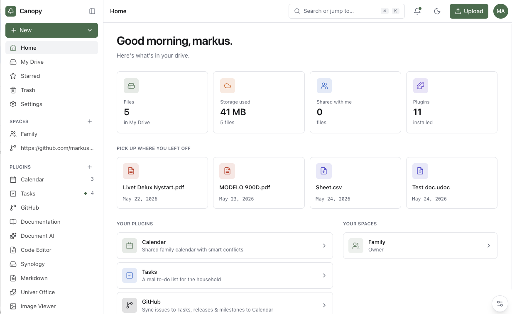

# Canopy

An extensible, Google-Workspace-style portal built as a **slim core with everything else as
plugins**. The first app is a **drive** over bring-your-own storage (local filesystem or
Cloudflare R2) — and the same shell hosts first-party apps (calendar, tasks, documentation)
and sandboxed file viewers right alongside it.



Built adapter-first so the same code runs locally on Node and as a single Cloudflare Worker.
Auth is OIDC (authhero). The UI is a Vite + React SPA with a desktop shell and a responsive
mobile shell.

> 📖 **The full guide ships inside the app.** Open the **Documentation** plugin — it's the
> landing page when you're signed out — to browse it, or read the same pages as markdown in
> [`documentation/`](documentation/), starting with the [Overview](documentation/01-overview.md).

## Layout

```
packages/
  core/                 @canopy/core             interfaces: StorageConnector, PluginRuntime, registry, contributions, plugin sources
  store/                @canopy/store            DB-backed drive: content-addressed blobs + dedup, files, versions, permissions (D1/libsql + R2/fs)
  plugin-sources/       @canopy/plugin-sources   resolve plugins from a GitHub folder, npm, or an uploaded zip
  connectors/
    local/              @canopy/connector-local  Node filesystem
    r2/                 @canopy/connector-r2     Cloudflare R2
    github/             @canopy/connector-github read-only; serves the documentation + demo drive from a repo
  runtimes/             (planned) sandbox adapters for dynamic plugin code
apps/
  api/                  @canopy/api              portable Hono API — Node entry (node.ts) + Worker entry (worker.ts)
  portal/               @canopy/portal           Vite + React SPA (the Drive UI; desktop + mobile)
examples/
  plugins/              sample plugins — a hook plugin, sandboxed image/PDF viewers, a markdown editor
demo/                   sample files for the anonymous demo drive (tracked; runtime data lives in storage/, which is gitignored)
```

## Storage model

The drive is **database-backed** (`@canopy/store`): the primary object is a *file record*, not a
file. Three concerns stay separate — an immutable, content-addressed **blob** (the bytes,
identified by SHA-256, stored once, reference-counted), a mutable **file** (id, name, metadata,
pointer to its current version), and a **version** (binds a file to its content at a point in
time). Metadata edits don't create versions; content changes don't touch metadata. Metadata is a
JSON column with expression indexes (no EAV); **virtual folders** are derived from a `metadata.path`
value, so the bytes stay flat.

Content is **polymorphic**: a version is either a Canopy-owned `blob` (dedup'd, refcounted) or an
`external` pointer into a connected store the user owns (filesystem / S3 / R2), indexed by key +
etag. *(The connected/indexed path and its long-running crawl — Cloudflare Workflows on the edge,
an in-process runner on Node — are in progress.)*

- **Dedup is per-tenant by default.** The blob key is namespaced `tenant/<sha256>` (tenant = the
  user's `sub`), so identical bytes dedup only within one tenant — cross-tenant dedup would leak
  which files exist. Global dedup is an explicit opt-in (`CANOPY_GLOBAL_DEDUP=1`).
- **Uploads are verified.** The client sends the hash to `POST /uploads/prepare`; on a miss it
  `PUT`s the bytes, and the server re-hashes them before storing — the client's hash is never
  trusted as the key.
- **`?embed=true`** on `GET /files/:id/content` is intended to project a subset of metadata into
  the file on the way out (XMP for images/PDF, core properties for docx) where the format supports
  it. The flag is wired; per-format projection currently passes the bytes through unchanged.
- **Delete is recoverable.** Deleting a file moves it to **Trash** (its versions and blobs are
  kept); restore it, or *permanently* delete to drop the records and release the bytes. A blob
  reference is released only on the permanent delete, not the move to Trash.

Storage adapters are swappable: **D1 + R2** on Cloudflare, **libsql (SQLite) + filesystem** on
Node/Docker. Schema is applied by a numbered migration runner on boot.

## Sharing & spaces

Access control is **relation tuples** in the spirit of Google Zanzibar (ReBAC) — but small: a
single recursive SQL query over one `relation_tuples` table, kept centralized so a check never
fans out across databases.

- **Spaces.** Every user has a **personal** space; **group** spaces (a family, a team) are
  co-accessed by their members. A group space surfaces as a **folder inside My Drive** (the
  merged, "family" feel) and can be **unpinned** to a sidebar switcher per user.
- **Per-file & per-folder sharing.** Grant a person (by email) or a whole space a role — **owner
  ⊇ editor ⊇ viewer** — on a single file or on one virtual folder and its subtree.
- **Canopy-native invites.** Invite anyone to a file or space **by email**. If they don't have
  an account yet it's a **pending invite** — share the **copyable invite link**, and it resolves
  the moment they sign in with that (**verified**) email. Authentication stays with your OIDC
  provider; membership lives in Canopy, so it's not tied to a vendor "organizations" feature.
- **Surface, not silo.** A space is a shared *context*; the drive surfaces it as a folder, and
  (planned) the calendar would surface the same space as a shared calendar.

See [`documentation/08-sharing-and-spaces.md`](documentation/08-sharing-and-spaces.md). Link sharing
("anyone with the link") is planned.

## Develop

Requires Node 22 (`.nvmrc`) and pnpm.

```bash
nvm use
pnpm install
pnpm dev        # api on :8787, portal on :5768 (Vite proxies /api → the api)
```

Open <http://localhost:5768>. The browser only talks to 5768; the API is proxied, so it's
same-origin in dev with full HMR.

## Auth (optional)

Without auth configured, the app runs as an anonymous demo. To enable login, copy the
example env and fill in your OIDC issuer + client:

```bash
cp .dev.vars.example .dev.vars   # then edit
```

It uses a confidential or public (PKCE) OIDC client, exchanges the code server-side (BFF),
and stores the session in an encrypted, HttpOnly cookie. Register
`http://localhost:5768/api/auth/callback` as an allowed callback on your client.

## Run as a single process (Node / Docker)

Serve the built UI **and** the API from one Node process on one port:

```bash
pnpm start      # builds the portal, then serves UI + /api on :8787
```

Point the local connector at any folder with `CANOPY_LOCAL_ROOT=/path pnpm start`.

Or with Docker (multi-stage build at the repo root):

```bash
docker build -t canopy .
docker run -p 8787:8787 -v /srv/files:/data canopy   # add -e SESSION_SECRET=… -e OIDC_… for auth
```

## Deploy to Cloudflare

[](https://deploy.workers.cloudflare.com/?url=https://github.com/markusahlstrand/canopy)

One click forks the repo into your own GitHub account and deploys it to your Cloudflare
account. The **R2 bucket, D1 database, and Workers AI** binding are provisioned automatically
(the committed [`wrangler.jsonc`](wrangler.jsonc) declares them without IDs), and the D1 schema
is created on first request — so a fresh deploy comes up as a **working anonymous demo with no
secrets**. When prompted by Workers Builds, use:

- **Build command:** `pnpm install && pnpm --filter @canopy/portal build` (produces the SPA in `apps/portal/dist`)
- **Deploy command:** `npx wrangler deploy`

To turn on login afterwards, add the OIDC vars and secrets — see [`.dev.vars.example`](.dev.vars.example).

### Deploy from your machine

Canopy is a **single Worker**: the API runs on the Worker and the built SPA is served from
Cloudflare **Static Assets** (Workers have no filesystem, so storage is **R2**). Config is the
committed, ID-less [`wrangler.jsonc`](wrangler.jsonc) at the repo root; Cloudflare provisions
R2/D1/AI on the first deploy.

```bash
# optional — enable login (a fresh deploy runs as the anonymous demo without these):
wrangler secret put OIDC_CLIENT_SECRET     # if your OIDC client is confidential
wrangler secret put SESSION_SECRET         # 32+ random bytes; encrypts the session cookie + stored secrets (AI keys, tokens) at rest
# then add vars.OIDC_ISSUER / OIDC_CLIENT_ID to wrangler.jsonc and register
# <your-url>/api/auth/callback as a callback on your OIDC client

pnpm deploy        # from the repo root: builds the portal, then `wrangler deploy`
```

`wrangler deploy --dry-run` validates the bundle and bindings without deploying. Wrangler writes
the provisioned resource IDs back into your local `wrangler.jsonc` — leave those out of commits so
the button keeps working ID-less for the next person. For the in-app guide, open the
**Documentation** plugin → _Deploying_. For the architecture, see
[`documentation/02-architecture.md`](documentation/02-architecture.md).

## License

MIT
