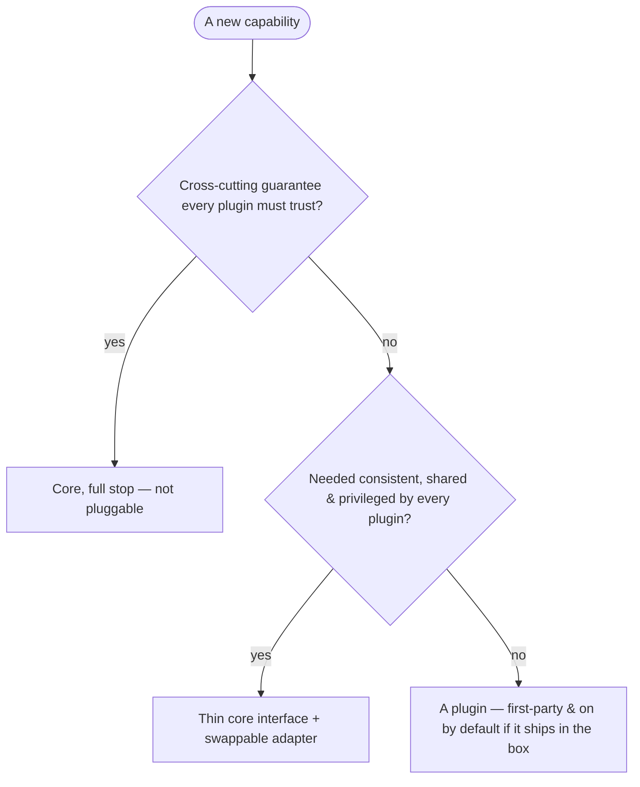
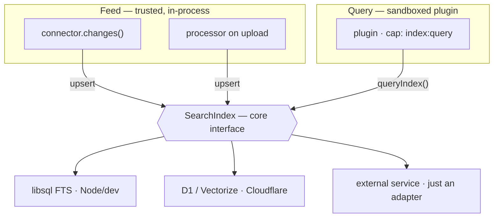
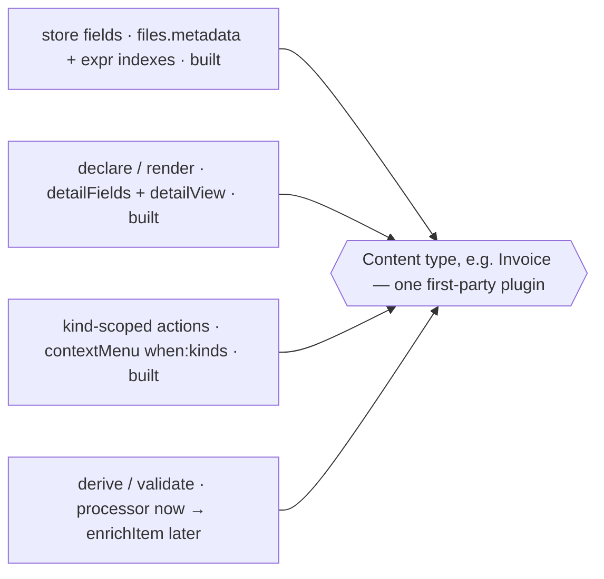

# What belongs in the core

Every interesting feature raises the same question: should it live in the **core**, or be a
**plugin**? Content types, search, comments, OCR, full-text indexing — each one invites the
debate. This page is the answer: a decision rule, the reasoning behind it, and two worked
examples (**search** and **content types**) that show the rule in action.

The short version is on the [How plugins work](how-plugins-work) page — *a plugin declares
what it needs and the host grants only that*. This page is the layer above that: not *how* a
plugin is wired, but *whether a given capability should be one at all*.

## "Core or plugin?" is usually the wrong question

Almost nothing substantial is purely one or the other. Every real capability in Canopy is
**three layers**:

- a thin **interface** in `@canopy/core` — the contract, zero runtime deps;
- a swappable **adapter** behind it — the concrete backend;
- one or more **plugins** on top — the opinion and the presentation.

Storage is the proof. `StorageConnector` is the interface; `connector-local`, `connector-r2`,
and `connector-github` are adapters; the drive UI and the Documentation plugin are what you
actually see. The cache is the same shape: `CacheStore` is the interface, `sql` and `cache-api`
are the adapters, and plugins reach it through the `kv` grant. A "feature" is a **vertical
slice** through all three layers, not a single box you drop on one side of a line:

```
                STORAGE          CACHE            SEARCH
  ┌───────────┬───────────────┬───────────────┬──────────────────┐
  │  CORE     │StorageConnector│  CacheStore   │  SearchIndex     │  the interface
  │ interface │               │               │                  │  (zero deps)
  ├───────────┼───────────────┼───────────────┼──────────────────┤
  │  ADAPTER  │ local · r2 ·  │ sql ·         │ libsql-FTS ·     │  swappable
  │           │ github        │ cache-api     │ Vectorize · svc* │  backend
  ├───────────┼───────────────┼───────────────┼──────────────────┤
  │  PLUGIN   │ drive UI ·    │ (used via the │ search UI ·      │  opinion &
  │           │ documentation │  kv grant)    │ index:query*     │  presentation
  └───────────┴───────────────┴───────────────┴──────────────────┘
   * planned
```

The principle is **mechanism vs. policy**. The core owns *mechanism* — the contract and the
data-plane access that has to be consistent. Adapters own the *backend*. Plugins own the
*policy*: what's opinionated, optional, domain-specific, and removable. So the real design work
is never "which side?" — it's **drawing the interface** and deciding what each layer owns.

## The decision rule

Three questions, in order. The first one that answers "yes" tells you where the capability goes.



The examples in parentheses below each question:

- **Q1 — a guarantee:** permissions, item identity, the capability broker.
- **Q2 — shared & privileged:** a byte store, a cache, a search index.
- **Q3 — an opinion:** optional, domain-specific, replaceable.

In table form:

| Layer | Owns | You reach for it when… | Examples |
|---|---|---|---|
| **Core (guarantee)** | A cross-cutting invariant | every plugin must trust it and it can't be opt-in | ACL & spaces, capability broker, item identity |
| **Core interface + adapter** | A shared, privileged data plane | every plugin needs it consistent, but the backend should swap per deployment | `StorageConnector`, `CacheStore`, `SearchIndex` |
| **Plugin** | An opinion or a presentation | it's optional, domain-specific, or removable | Calendar, Tasks, Documentation, viewers, content types* |

<sub>* planned / designed, not yet built.</sub>

## The short list that must be core

Almost everything leans plugin-forward. The exceptions — things that genuinely *cannot* be a
plugin, because they're cross-cutting guarantees every plugin has to be able to trust — are a
short list:

- **Access control & spaces** — the relation-tuple model in [Sharing & spaces](sharing-and-spaces).
  A plugin can't be allowed to redefine who can read a file.
- **The capability broker** — the thing that decides what each plugin is granted. If it were
  itself pluggable, the sandbox would mean nothing.
- **Item identity & the metadata store** — the `files` record, its id, and its `metadata` column.
  Everything else hangs off a stable item.
- **The registry** — how contributions are collected and rendered. It's the seam the whole
  plugin model plugs into.

If a feature isn't on this list, the default answer is *not core*.

## The pressure valve: first-party plugins

The north star is "a small piece of well-made furniture for a household," not an enterprise
everything-store. The standing risk to that is **core bloat** — every ambitious feature wants a
home in the middle, and a core that accretes features stops being slim.

The escape valve is already built: **ship ambitious features as first-party plugins through the
same registry as third-party ones.** Calendar, Tasks, and Documentation already work this way —
they register a `PluginManifest`, contribute to the same surfaces, and are subject to the same
capability model (see *How first-party plugins run right now* in
[How plugins work](how-plugins-work)). A first-party plugin can be **on by default**, so the
feature is present out of the box — but it stays **removable, replaceable, and outside
`@canopy/core`**.

This is what keeps Canopy from drifting into SharePoint territory. The answer to "shouldn't the
platform do X?" is rarely "put X in the core." It's "ship X as a default plugin." That way the
*product* can be rich while the *core* stays a thin substrate.

## Worked example: search *(built; plugin query grant pending)*

Search is the textbook case of question 2, and the codebase has now built the bottom two layers.
The **`SearchIndex` interface is drawn** in `@canopy/core` — a feed side (`upsert`/`delete`) and
an ACL-scoped query side — and a **SQLite/D1 FTS5 adapter** (`createSqlSearchIndex`) sits behind
it, selected per deployment in the host exactly like the cache backend. `StorageConnector` already
carries the optional `changes()` feed meant for indexing. The index is now **fed on every
managed-drive change** and queried by the host's ACL-scoped `GET /api/search`, surfaced through a
**⌘K command palette**. What's left is the plugin-facing edges: feeding from *connected* spaces via
`connector.changes()`, and enforcing the scoped `queryIndex` grant so sandboxed plugins can query
too. Search was never meant to be a single monolithic plugin; it was always meant to be a
**core-queryable index**.

So it follows the storage pattern exactly:

- **Core** — a thin `SearchIndex` interface: a feed side (`upsert`/`delete`) and a query side.
- **Adapter** — the backend swaps per deployment: a single SQLite **FTS5** adapter
  (`createSqlSearchIndex`) already covers both Node (libsql) *and* the edge (D1) — both are SQLite
  — while **Cloudflare Vectorize** (semantic) or an external service would be further adapters.
  **"Platform search that needs a service" is just another adapter** — not a fork in the design,
  exactly like R2 is just another `StorageConnector`.
- **Feeding it** — trusted, in-process connectors and processors push documents in on change
  (the same place [Document AI](how-plugins-work) already runs). This is the I/O boundary; it
  isn't sandboxed.
- **Querying it** — plugins request `index:query` and get a scoped `queryIndex()`. A search
  **UI** (a command palette, a rail panel) is itself a plugin contribution.



The payoff: "platform search" vs. "plugin search" stops being a decision. It's one index, fed
and queried through stable contracts, with the backend chosen per deployment.

> **Status:** the `SearchIndex` interface and a SQLite/D1 **FTS5 adapter** are built — wired into
> the host per deployment, with a shared contract-test suite the backend passes. The index is fed
> on every managed-drive change, queried by the host's ACL-scoped `GET /api/search`, and surfaced
> in a ⌘K command palette. Still pending: feeding it from *connected* spaces via
> `connector.changes()`, and enforcing the scoped `queryIndex` grant so plugins can query (the
> palette is host UI today, not yet a plugin contribution). **Vectorize / semantic search** remains
> a later adapter.

## Worked example: content types *(mostly buildable today)*

Content types are the textbook case of question 3 — and the textbook **trap**. In SharePoint,
content types are where the enterprise complexity lives: inheritance, site columns, mandatory
fields, retention policies, a content-type hub. Put that machine in the core and the "slim core"
is over.

The Canopy answer is that a content type is **emergent** from primitives that already exist — not
a new core subsystem. A "type" like *Invoice* is just a composition:



Every row already exists. Durable, filterable per-item fields are the `files.metadata` JSON
column with expression indexes (see [Storage & files](storage-and-files)). Declaring and
rendering those fields is the `detailFields` / `detailView` contribution model. Behaviour scoped
to a kind is `contextMenu` with `when: { kinds }`. Deriving or validating on change is a
**processor** today, and will be the sandboxed `enrichItem` hook once the runtime lands.

So **content types are a plugin pattern, not a core feature.** The only core-owned pieces are the
generic metadata bag and the contribution slots — and both already ship. If we want a default set
of types out of the box, that's a first-party plugin (and a natural `/new-plugin` template), not
an addition to `@canopy/core`. That's how we get the useful 80% of content types without
importing SharePoint's model — and without a single new core concept.

## Rule of thumb

> Is it a cross-cutting guarantee every plugin must trust? → **core, full stop.**
> Does every plugin need it consistent, shared, and privileged? → **thin core interface +
> swappable adapter.**
> Is it an opinion? → **a plugin** — first-party and default if it should be there out of the box.

The instinct to "just have an interface" is almost always right. The work is drawing it well,
and remembering that the core's job is to stay small while the *product* gets rich through
plugins. See [How plugins work](how-plugins-work) for the contracts and
[Writing a plugin](writing-a-plugin) for the hands-on path.
