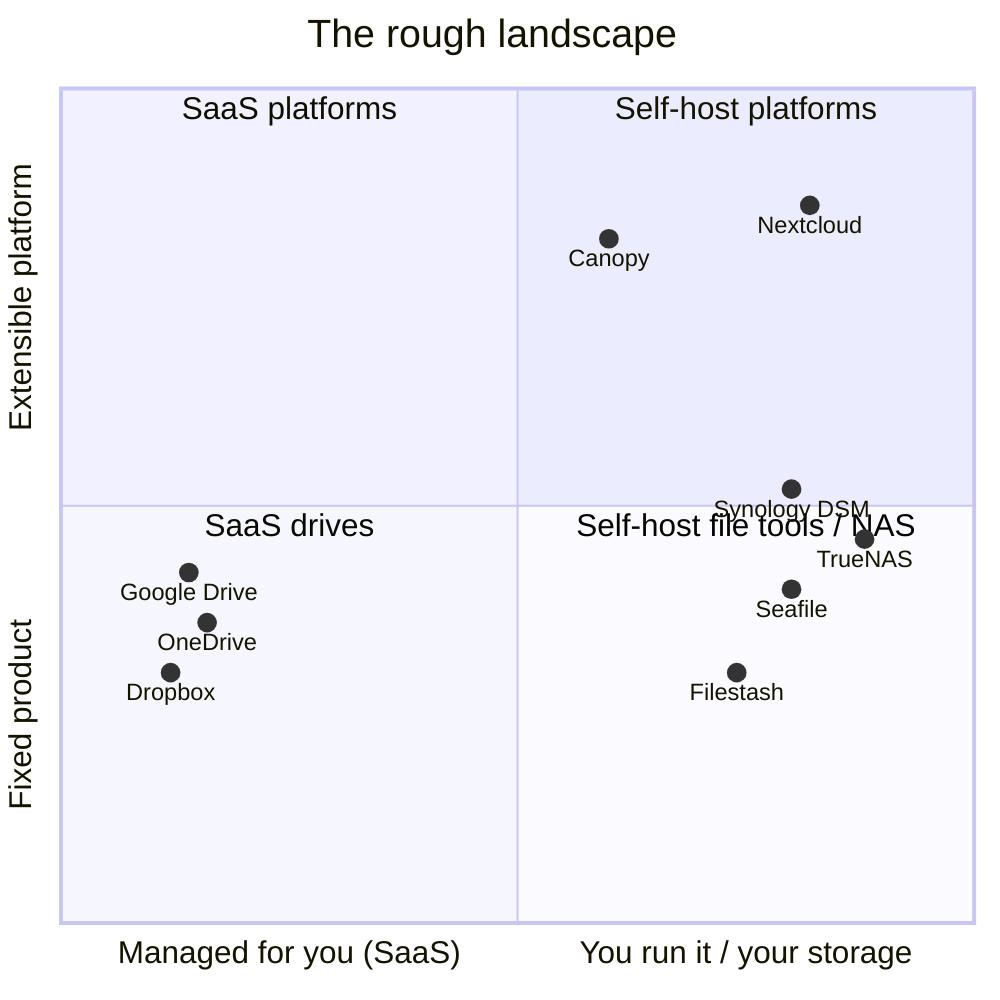

# How it compares

Canopy is **early, open-source (MIT), and small on purpose** — closer to a hobby-scale "piece of
furniture" than a product. This page is an honest read on where it sits next to the things people
actually use, with a feature table and a page per service. It is **not** trying to replace Google
Drive or out-feature Nextcloud; it occupies a narrower niche, described below.

## The one-line positioning

> An **edge-native, bring-your-own-storage drive and plugin portal** you deploy as a single
> Cloudflare Worker (or a Node process) and extend with sandboxed plugins.

The part no one else in this list does: **run the whole thing serverless on the edge** — one
Worker + R2 + D1, scale-to-zero, no box and no VM to maintain — while keeping your bytes in
storage you own.

## Where it sits

A map can't show every axis. Canopy's oddity is that it's **self-hosted yet (almost) ops-free**:
you own the deployment and the storage, but on Cloudflare there's no server to patch — it sits
between "SaaS" and "run-your-own-box," which a 2-D chart flattens.

## Feature support at a glance

A rough guide, not a scorecard — the per-service pages below have the nuance.

Drive-like products only — MinIO, Syncthing, and Paperless-ngx are different categories (storage,
sync, document management) and don't fit these columns; see their pages below.

| | Self-host | Your bytes | Serverless | Plugins | Co-edit | Apps / sync |
|---|:---:|:---:|:---:|:---:|:---:|:---:|
| **Canopy** | ✓ | ✓ | ✓ | ✓ | ~ | ✗ |
| [Google Drive](compare-google-drive) | ✗ | ✗ | — | ~ | ✓ | ✓ |
| [Dropbox](compare-dropbox) | ✗ | ✗ | — | ~ | ~ | ✓ |
| [OneDrive](compare-onedrive) | ✗ | ✗ | — | ~ | ✓ | ✓ |
| [Proton Drive](compare-proton-drive) | ✗ | ✗ | — | ✗ | ~ | ✓ |
| [Nextcloud](compare-nextcloud) | ✓ | ✓ | ✗ | ✓ | ~ | ✓ |
| [ownCloud](compare-owncloud) | ✓ | ✓ | ✗ | ~ | ~ | ✓ |
| [Seafile](compare-seafile) | ✓ | ✓ | ✗ | ~ | ✗ | ✓ |
| [Pydio Cells](compare-pydio-cells) | ✓ | ✓ | ✗ | ~ | ~ | ✓ |
| [Synology](compare-synology) | ✓ | ✓ | ✗ | ~ | ✓ | ✓ |
| [TrueNAS](compare-truenas) | ✓ | ✓ | ✗ | ~ | ✗ | ~ |
| [Filestash](compare-filestash) | ✓ | ✓ | ✗ | ~ | ✗ | ✗ |

✓ yes · ~ partial or planned · ✗ no · — not applicable. **Columns:** *Self-host* = you run
it · *Your bytes* = files live in storage you control · *Serverless* = deployable as edge /
scale-to-zero with no server to run · *Plugins* = a real extension model · *Co-edit* = real-time
collaborative editing · *Apps / sync* = native mobile apps and/or a desktop sync client. Canopy's
`~`/`✗` (co-edit, apps) are the honest gaps; see [what works today](overview). Proton Drive's
distinguishing feature — end-to-end encryption — isn't a column here; see its page.

## The contenders

Each links to a fuller page, grouped the way the nav is.

**Consumer cloud** — polished SaaS; your files live on their servers.
[Google Drive](compare-google-drive) (collaboration + mobile), [Dropbox](compare-dropbox)
(best-in-class sync), [OneDrive](compare-onedrive) (Windows + Office), and
[Proton Drive](compare-proton-drive) (end-to-end encryption — the one thing Canopy doesn't do).

**Self-hosted platforms** — the closest in spirit, but heavier to run than Canopy's single Worker.
[Nextcloud](compare-nextcloud) (huge app ecosystem), [ownCloud](compare-owncloud) (classic + the
Infinite Scale rewrite), [Seafile](compare-seafile) (excellent block-level sync),
[Pydio Cells](compare-pydio-cells) (enterprise-leaning), and [Filestash](compare-filestash) (a web
UI over storage you already have — the nearest cousin to one Canopy idea).

**NAS operating systems** — whole storage stacks tied to hardware; Canopy isn't a NAS, it runs *on
top of* one. [Synology](compare-synology), [TrueNAS](compare-truenas).

**Storage & sync** — a layer below or beside Canopy, not a competitor. [MinIO](compare-minio) (an
S3 backend Canopy can sit on), [Syncthing](compare-syncthing) (peer-to-peer folder sync).

**Document management** — adjacent to Canopy's Document AI direction.
[Paperless-ngx](compare-paperless-ngx) (OCR + tagging + full-text search for paperwork).

Still without their own page: **Filebrowser, Cloudreve, FileRun** (lightweight file managers) ·
**Garage, SeaweedFS, Rclone, Resilio Sync** (storage & sync) · **Docspell, Mayan EDMS** (document
management) · **Cryptomator** (client-side encryption you can layer on any of the above).

## Where Canopy is honestly behind (today)

- **Maturity** — early and small-scale; expect rough edges.
- **No native mobile or desktop sync** — responsive web and a WebDAV mount only; no Dropbox-style
  block-level delta sync.
- **No real-time office editing** — collaborative Markdown is designed, not built.
- **Search works, with edges pending** — the core `SearchIndex` interface and a full-text
  (SQLite/D1 FTS) adapter are built; files are reindexed on change and searchable from a ⌘K
  command palette via `GET /api/search`. Still in progress: the connected-space `changes()` feed
  and the plugin-facing `queryIndex` grant. Vector / semantic search is still planned.
- **Small ecosystem** — a handful of first-party plugins vs Nextcloud's hundreds.
- **No end-to-end encryption** — it encrypts *secrets* at rest, not file contents E2E.
- **Not a NAS** — no disk management, RAID, snapshots, or backup orchestration.

## Where Canopy is genuinely different

- **Edge-serverless deployment** — one Worker + R2 + D1, scale-to-zero, free/cheap tiers, no
  server to maintain. Nothing else here does this.
- **Bring-your-own-storage, two ways** — a managed, deduplicated drive *or* (in progress) index an
  existing bucket/folder **in place**; your bytes stay where they are.
- **Adapter-first portability** — the same code runs on Node and on a Worker.
- **Slim core + plugins** — first-party features are plugins on the same contract a third party
  uses; untrusted plugins run sandboxed.
- **Bring-your-own identity** — OIDC + Canopy-native email invites, not a vendor account silo.
- **AI labeling out of the box** — on Workers AI, Document AI tags and describes uploads with no
  key to manage.

## Which should you choose?

- **Google Drive / Dropbox / OneDrive** — polish, mobile, real-time collaboration, zero ops, and
  you're fine with your files on their servers.
- **Nextcloud / Seafile** — a mature, self-hosted platform with a big ecosystem, and you're happy
  running a server.
- **Synology / TrueNAS** — you want the storage hardware itself: RAID, snapshots, backups, media.
- **Filestash** — a light web UI over storage you already have.
- **Canopy** — an **edge-native, hackable, bring-your-own-storage** drive and portal to build on,
  where you own the bytes and the identity, and you can live with early software.
